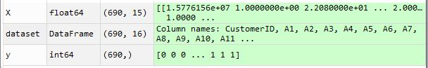
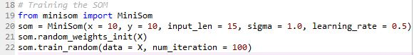
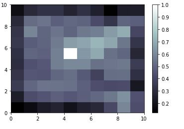
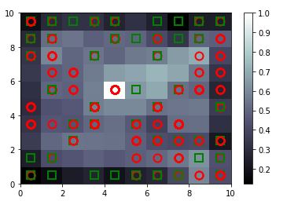
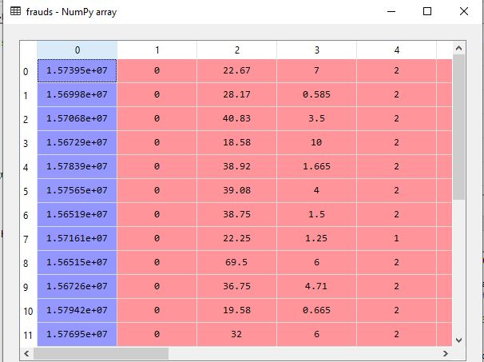

# Something Suspicious 
## What is [Fraud Dectection?](https://medium.com/@Nethone_/a-beginners-guide-to-machine-learning-in-payment-fraud-detection-prevention-360c95a9ca54)

In simple Data Science language , its somewhat similar to detecting the outliers in a dataset. 

Here, I will be solving a fraud detection problem using an unsupervised learning technique called as Self Organizing Maps(SOMs).

## What are SOMs?
A self-organizing map (SOM) is a type of artificial neural network (ANN) that is trained using unsupervised learning to produce a low-dimensional (typically two-dimensional), discretized representation of the input space of the training samples, called a map.
In a nutshell , it will reduce multi-dimentional data into a clustered 2D representation. And outliers can be easily detected from that clusters and backtracking can be done to obtain original outlier from the dataset.

Here is the original [research paper](https://sci2s.ugr.es/keel/pdf/algorithm/articulo/1990-Kohonen-PIEEE.pdf) by Teuvo Kohonen , the academic researcher who invented SOMs in 1980s.

## About the Dataset 
The Statlog (Australian Credit Approval) Data Set from the UCI machine learning repository contains the credit card approval information.It is a good mix of attributes thus which  makes it perfect for SOMs.

## Solution 
The py file of the solution can be found with the name " Fraud_Som.py ".

### Following Sections can be found in the solution py file :
#### Importing the libraries 
This involves importing all the necessary python libraries.

#### Importing the Dataset 
Here ,I imported the csv under the variable name 'dataset'.

Further, X corresponds to the all the attributes of the dataset except the last i.e. class - wheather that customer credit card request has been granted or not.
y corresponds to the class. 

Note: Here y is not the dependent attribute , I have seperated it for the ease of visualization . Since it is Unsupervised Problem so I will trin my Som on X .

#### Feature Scaling 
All the columns/attributes are scaled with MinMaxScaler with feature range : (0,1)

#### Training the Som
Since Self Organizing Maps do not have implemetation in scikit learn , so I found an implementation by a developer . you can find the link to his github [here.](https://github.com/JustGlowing/minisom)
For the ease , I am providing you with the "minisom.py". Just put it in your working directory and you are good to go.

An instance of the Minisom class have the following parameters 
- x,y Dimentions of map
- input length 
- sigma : radius of influence
- learning rate

Using random weights , neural network is initialized and then trained over 100 iterations . 

#### Visualizing the results
Here the Map is visualized . 

The above picture shows all the [winning nodes](https://medium.com/@abhi95.saxena/fraud-detection-using-self-organizing-maps-unsupervised-machine-learning-5c78ae39a584) in each case . As per the color bar more whiter the node , more the mean inter-neuron distance i.e. neuron is an outlier with possible cases of fraud. 

##### Note: Here I will now use the y. I will plot the y as marker over the winning neurons which will give an idea whether the request of fraudent customer has been accepted or not.

Below image has one white winning neuron with the cases of the "not accepted" request mark. 

#### Finding the frauds 
Here , I am mapping the original X with the Map we formed . And getting the list of the customer (under the white winning neuron) , futher inverse transforming it in its orginal form by using the same scaler object.

So fraud object gave me the list of 23 possible fraudent customers who applied for credit card but got rejected(Red marker) . 

##### Under Data Analysis , this information can be very useful as bank can use this information to blacklist those customers and prevent future fraud.
