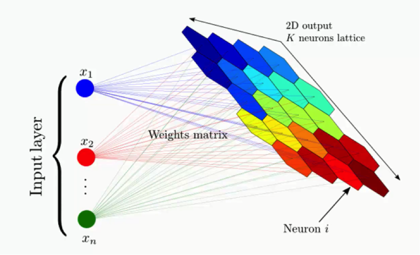
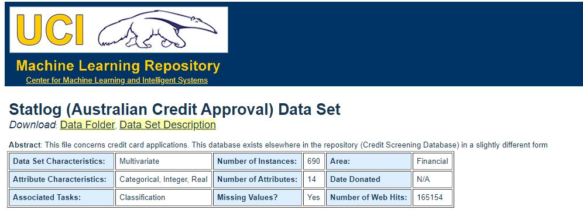

# Something Suspicious 
## What is [Fraud Dectection?](https://medium.com/@Nethone_/a-beginners-guide-to-machine-learning-in-payment-fraud-detection-prevention-360c95a9ca54)

In simple Data Science language , its somewhat similar to detecting the outliers in a dataset. 

Here, I will be solving a fraud detection problem using an unsupervised learning technique called as Self Organizing Maps(SOMs).

## What are SOMs?
A self-organizing map (SOM) is a type of artificial neural network (ANN) that is trained using unsupervised learning to produce a low-dimensional (typically two-dimensional), discretized representation of the input space of the training samples, called a map.
In a nutshell , it will reduce multi-dimentional data into a clustered 2D representation. And outliers can be easily detected from that clusters and backtracking can be done to obtain original outlier from the dataset.

Here is the original [research paper](https://sci2s.ugr.es/keel/pdf/algorithm/articulo/1990-Kohonen-PIEEE.pdf) by Teuvo Kohonen , the academic researcher who invented SOMs in 1980s.

## About the Dataset 
The Statlog (Australian Credit Approval) Data Set from the UCI machine learning repository contains the credit card approval information.It is a good mix of attributes thus which  makes it perfect for SOMs.

## Fraud Detection using Self Organizing Maps (SOMs)
## About the Code
